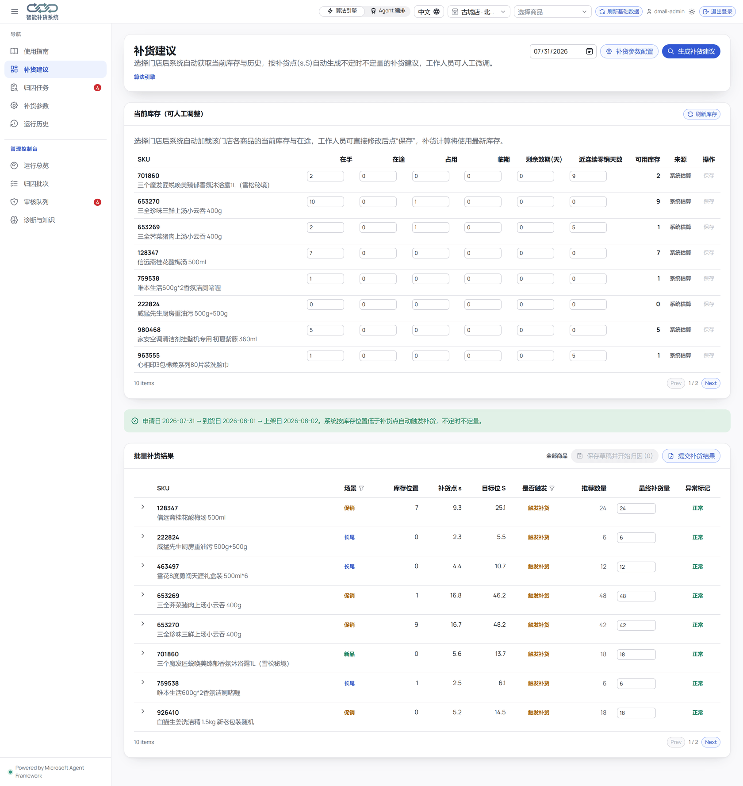
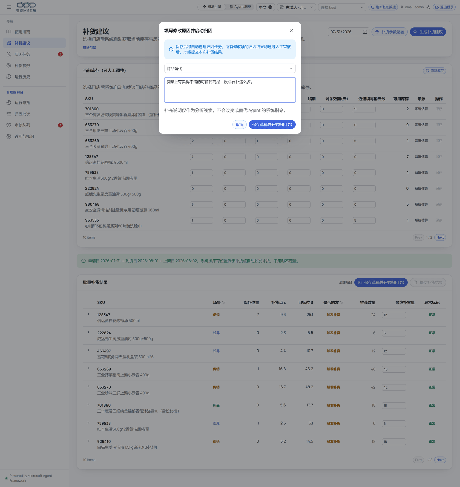
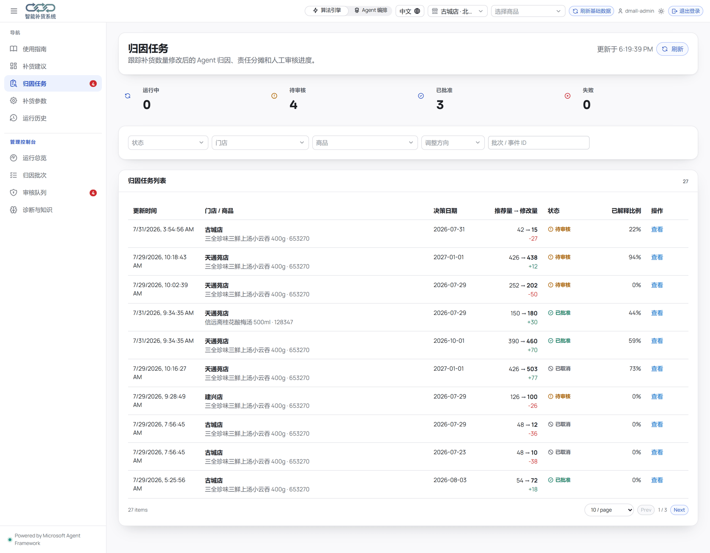
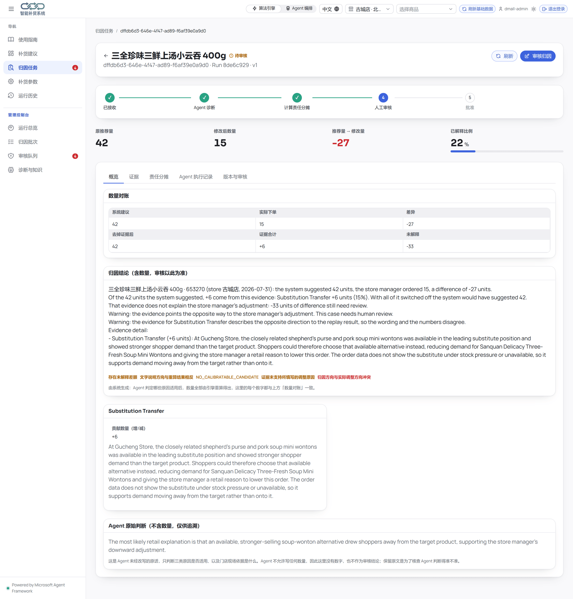
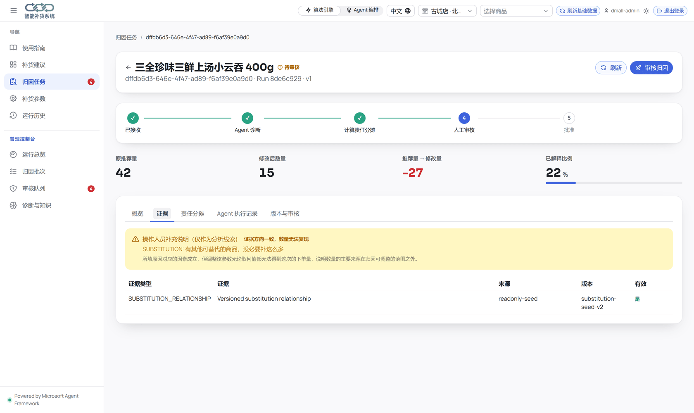
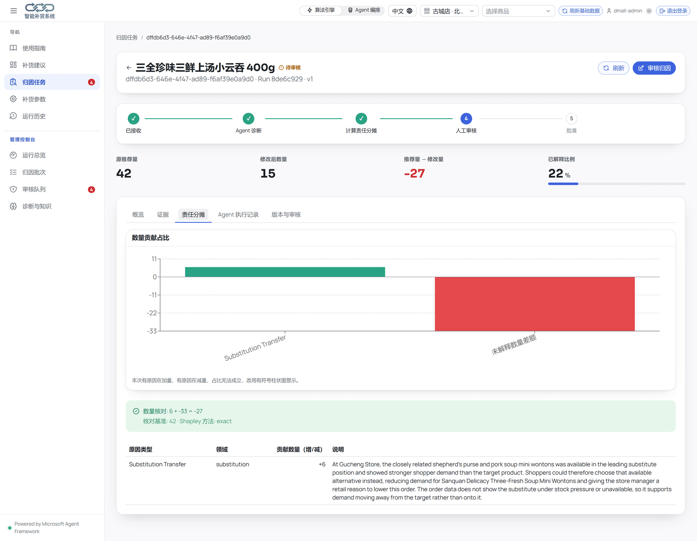
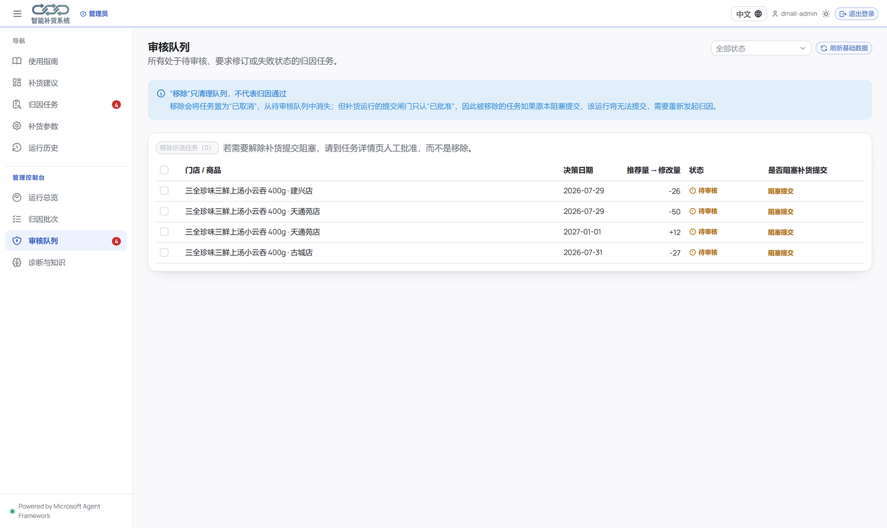
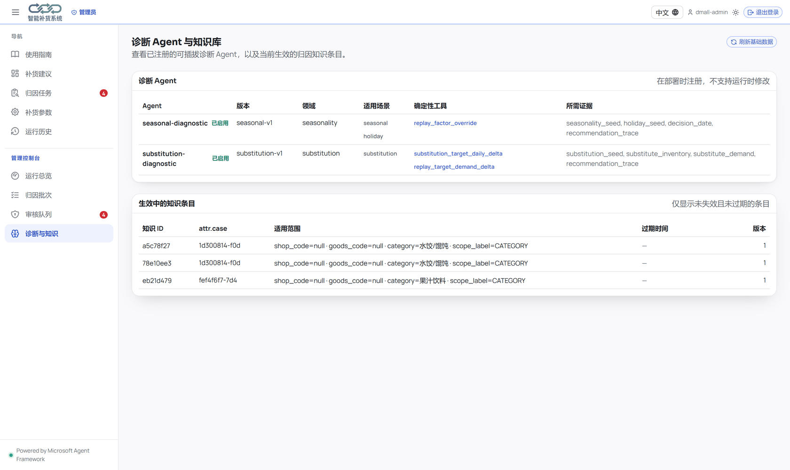
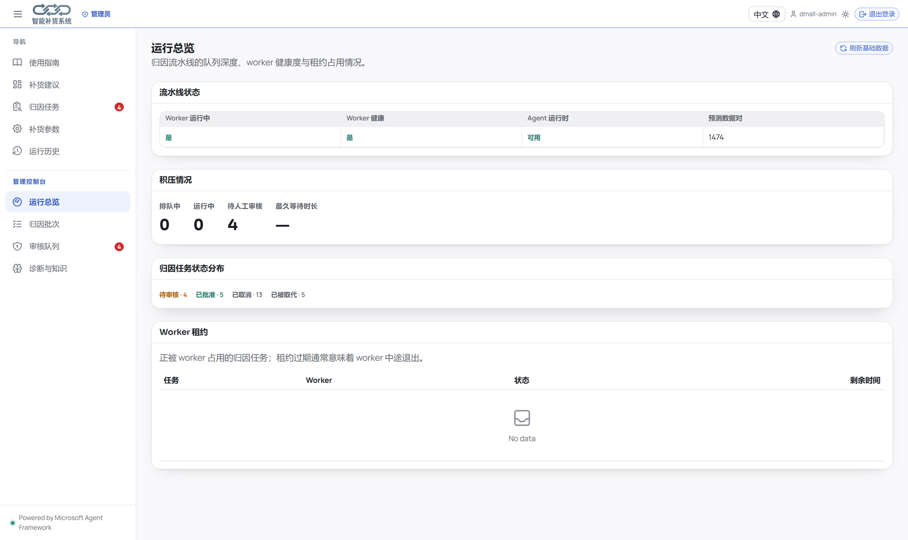

# Agentic 门店补货与自诊闭环系统

**语言：** [English](README.md) · **中文（当前）**

这是一个端到端门店补货与自诊闭环方案：

- 确定性 `(s, S)` 补货引擎生成可审计的 SKU 建议量。
- Microsoft Agent Framework 负责补货 Agent 编排。
- Harness 归因协调器调用季节、节假日与商品替代关系的诊断能力。
- 确定性反事实回放、Shapley 拆解与守恒校验负责计算因果贡献。
- 日销量回流生成决策台账，用实际销量同时校验系统建议和人工改数。
- 归因知识按“门店 × SKU”沉淀，只有实测准确率达标才给引擎叠加权重。
- React 前端提供补货调字、归因审核与最终提交。
- SQLite 用于本地开发，Azure PostgreSQL 用于多副本部署。

## 界面速览

下面按系统实际运行的顺序，展示完整闭环。截图来自运行中的应用，数据为预置演示数据。

### 1. 引擎给出建议，并公开推导过程

每一行都附带生成它的 `(s, S)` 输入参数：需求预测、安全库存、提前期、现有库存与在途库存。店长面对的是清晰的推导算术，而不是黑盒结论。



### 2. 改数可以，但必须给理由

店长可以随时调整订货量。选择原因类型并填入说明后，系统会将这段文字**记录为待核验的主张，而不是直接采信的证据**。



### 3. 每次调整自动生成归因 Case

只要有未闭环的 Case，整个批次（Run）就无法提交。再次修改数量会让旧 Case 作废（`SUPERSEDED`），旧审批同步失效，保证审批与最终数字始终绑定。



### 4. Case 台账：改了什么，相对什么基准

反事实归因会关掉模型点名的具体原因重新计算，得出裸基线数量（`bare_baseline_qty`），让季节和节假日因素第一次有了可度量的对照面。



### 5. 用证据评判店长的主张

系统会自动验证：*店长给出的原因，通过反解引擎参数能否复现他填写的订货量？* 确定性代码反解引擎会给出判定。例如 `UNCALIBRATED` 表示方向没错，但数量无法复现——厘清“有理由”与“算得通”的区别。



### 6. 带符号的分摊与守恒校验

各项因果贡献相加必须等于实际调整差值。计算残差会明确展示出来：它代表引擎现有假设无法解释的那部分改数分歧，而这正是知识候选要解决的问题。



### 7. 卡住提交的审核队列

任何未闭环的 Case 都会阻塞所在 Run 的提交。注意：**“忽略”不等于“批准”**，忽略仅代表撤销 Case，该批次在重跑归因前将一直无法提交。



### 8. 被采纳的知识进入下一次补货

知识条目的权重完全靠后续实际销量兑现来赚取。没有靠审核人员主观信心晋级的条目，每一份权重都来自实测验证。



### 9. 运维视图

展示 Worker 健康度、队列深度、Case 状态分布与租约占用。租约过期能及时发现异常中断的 Worker，避免任务无声卡死。



## 核心业务约束

店长只要修改了建议补货量（`final_qty != chosen_qty`），就必须完成对应数量版本的归因诊断，并经人工审核通过，全批次（Run）才允许提交。

```text
生成补货建议
  -> 修改数量并填写原因
  -> 自动创建归因 Case
  -> Agent/Harness 诊断
  -> 确定性反事实与 Shapley 归因
  -> 人工审核
  -> 全部修改项 HUMAN_APPROVED
  -> 整个 Run 原子提交并锁定
```

系统不允许跳过归因或强行提交：

- 再次修改数量会将旧 Case 标记为 `SUPERSEDED`，旧审批立即失效。
- 缺失主要证据的 `partial` 报告不能直接过，需补充人工归因。
- Agent 连续失败后可进行结构化人工归因，但仍需审核。
- 提交采取“全有或全无”原则（原子提交），成功后锁定为只读。
- 审批与知识沉淀相互独立：审批只解锁提交，知识必须逐条裁定（采纳 / 修订后采纳 / 驳回）。

## 归因产出：从“分摊数量”到“知识候选”

分摊（`allocations`）解决的是当次数量差异如何在各原因间划分，但无法直接回答“下一次系统该如何假设”。

传统分摊有个结构缺陷：如果以引擎自带的重算结果为基准，由于基准里已经包含了季节、节假日系数，重新注入这些因子的贡献就会始终为零——季节和节假日永远分不到任何数量。现在的做法是**把模型指出的原因从基准中关掉**，重新计算出裸基线数量（`bare_baseline_qty`）：

```text
Σ signed_contribution_qty + unexplained_signed_gap = override_qty − conservation_anchor_qty
```

`conservation_anchor_qty` 在反事实报告中等于 `bare_baseline_qty`，在人工撰写的报告中回落为 `recommended_qty`。未经模型点名的假设保持引擎原值，作为当次决策的输入背景。

出现残差是正常现象：它说明引擎现有的假设只能解释一部分，店长改数的其余分歧未被解释——这正是知识候选（而不是简单分摊）要解决的问题。

因此报告在输出分摊的同时，还会输出 `knowledge_candidates`：**Agent 只提供条件和适用范围，不出具体数值**。确定性代码反解引擎会搜索 `kind` 指定参数的临界取值，算出能复现店长订货量的参数变动。知识候选的本质就是“引擎参数需要调整多少”，从而消除了多解退化（degeneracy）问题。

```text
calibration_status: EXACT | APPROXIMATE | UNREACHABLE | ALREADY_CORRECT | BLOCKED
acceptable = calibration_status ∈ {EXACT, APPROXIMATE}
```

- **`UNREACHABLE` 是明确的诊断结论，而非系统失败。** 例如店长将 48 改为 10，但整箱起订下限是 18——任何需求系数都无法推出 10，说明这次改数并非出于需求判断。此时系统清空 `proposed_value` 并保留 `boundary_value`，阻止审核人员采纳已被引擎证明无效的数值，同时打上 `NO_CALIBRATABLE_CANDIDATE` 风险标记。
- **`magnitude_plausible: false` 仅作风险预警，不强制拦截。** 例如精确计算得出 4.6 倍的季节系数；参数是否合理由人工裁定，按 `WRONG_MAGNITUDE` 驳回即代表闭环在正常生效。

### 审核记录驳回，而不只是记录同意

审核机制从“整单通过/退回”升级为**逐条候选裁定**。驳回原因限定在固定词表中：
`WRONG_CAUSE` / `NOT_THE_DRIVER` / `WRONG_SCOPE` / `WRONG_MAGNITUDE` / `ONE_OFF_EVENT` / `INSUFFICIENT_EVIDENCE` / `ALREADY_KNOWN` / `OTHER`。只有词表封闭，不同审核人的统计数据才具备可比性。

驳回记录独立建表，不在知识库里加 `REJECTED` 状态：驳回项没有有效取值和作用范围，混入知识表容易被引擎误读。原始候选完整留存，方便后续优化提示词时对着错例重放测试。

| 接口 | 说明 |
|---|---|
| `GET /api/attribution/knowledge/rejections` | 被驳回的知识候选，可按门店/SKU/原因筛选 |
| `GET /api/attribution/knowledge/feedback` | 归因 Agent 的成绩单：采纳率，以及按原因分组的驳回统计 |

## 学习闭环：从归因到准确率

归因解决的是“为什么改”，但并不保证“改得对”。如果只靠归因和审批，系统沉淀下来的只是店长偏好，而不是客观规律。引入 POS 实际销量回流，才能形成闭环：

```text
提交锁定 -> 为每条决策开启评判窗口(含未修改行)
  -> 日销量回流(POS)
  -> 窗口闭合后计算事后最优量
  -> 判定 ENGINE_BETTER / HUMAN_BETTER / TIE
  -> 更新相关知识条目的后验置信度
  -> 置信度足够时知识才开始影响引擎
```

设计要点：

- **未修改行同样进入台账。** 如果只关注店长改过的行，系统就无法发现“店长没改但建议本身错误”的情况。
- **评判窗口取决策日次日起，长度为提前期 + 覆盖天数。** 仅读取冻结快照，不读当前配置，避免用今天的参数评判过去的决策。
- **缺货损失计入真实需求。** 货架卖空属于未满足的需求而非低需求，否则订货量越小越容易被误判为正确。
- **窗口未闭合保持 `PENDING`，不计入平局。** 仅有 `COMPLETE` 状态的记录会纳入准确率看板与知识晋升计算。
- **箱规以内的差距视为平局。** 半个箱规以内的误差双方都无法精准控制，不作为优劣判定依据。
- **知识刚生成时权重为 0。** 权重基于胜率的 Wilson 置信区间下界计算，状态流转（`CANDIDATE -> SHADOW -> ACTIVE -> RETIRED`）完全由销售业绩数据驱动；一旦实测效果下滑，权重会自动回落并退役，不需要人工清理。

### 知识如何真正影响下一次补货

`ACTIVE` 状态的知识条目在下一次补货时会自动转换为引擎输入参数。这样避免了“知识虽然通过了审批，但对系统没有任何实际影响”的假闭环问题。

```text
engine.KNOWLEDGE_TARGETS = factor_overrides.season | factor_overrides.holiday
                         | target_daily_demand_delta | params.fill_rate | params.shelf_max
```

- **无法生效的知识必须明确报错，不能静默忽略。** 比如 `SUBSTITUTION_RATE` 属于原始输入而非引擎可调参数，系统会明确标记为 `unsupported`。
- **调用方显式传入的参数永远优先。** 保证反事实重算时固定探针系数的逻辑不受影响。
- **每次计算都会生成 `knowledge.resolve` 追溯记录**（无论是否命中知识），保证追溯编号一致。
- **历史决策绑定的知识在提交时即冻结快照。** 后续新采纳的知识不会改写历史归因基线，防止历史归因随知识库扩充而发生漂移。

新增接口：

| 接口 | 说明 |
|---|---|
| `POST /api/attribution/outcomes/daily-sales` | 回流日销量（可含缺货损失），幂等并触发重算 |
| `GET /api/attribution/outcomes` | 决策结果台账，可按门店/SKU/状态/判定筛选 |
| `GET /api/attribution/accuracy` | 准确率看板：引擎与人工的 MAE/MAPE、胜率、缺货与超储 |
| `GET /api/attribution/knowledge` | 知识条目，可按门店/SKU/状态筛选 |
| `GET /api/attribution/knowledge/resolve` | 某门店 × SKU 当前实际生效的知识及其权重 |

## 主要模块

| 路径 | 说明 |
|---|---|
| `forecasting_cache/` | 预计算的门店 × SKU 预测输入 |
| `backend/engine.py` | 确定性 `(s, S)` 补货引擎 |
| `backend/agent_runtime.py` | 补货 Agent Framework 编排 |
| `backend/attribution/` | Case/Run 状态机、Harness、反事实归因、Worker、持久化 |
| `backend/attribution/outcomes.py` | 决策结果评判：窗口、事后最优量、判定与准确率聚合（纯函数） |
| `backend/attribution/knowledge.py` | 知识置信度：Wilson 下界、权重、状态流转、范围匹配及引擎指令转换（纯函数） |
| `backend/api/main.py` | FastAPI 补货、归因、审核和提交 API |
| `backend/migrations/` | SQLite/PostgreSQL Alembic 迁移 |
| `frontend/` | React + Ant Design 补货和归因审核 UI |
| `infra/` | PostgreSQL、托管身份、迁移 Job 和 Container Apps |
| `CONTRACT.md` | 完整 API 与状态机契约 |

## 本地运行

### 前置条件

- Python 3.11 或更高版本
- Node.js 18 或更高版本
- npm
- 可选：Azure CLI（用于连接 Microsoft Foundry）

### 1. 安装后端

```powershell
cd backend
python -m venv .venv
.\.venv\Scripts\Activate.ps1
pip install -r requirements.txt
Copy-Item .env.example .env
```

默认使用 `sqlite+aiosqlite:///./attribution.db`。本地启动时会自动创建数据库表。

如需启用真实 Harness Agent Loop，编辑 `backend\.env`：

```dotenv
FOUNDRY_PROJECT_ENDPOINT=https://<resource>.services.ai.azure.com/api/projects/<project>
FOUNDRY_MODEL_DEPLOYMENT=<model-deployment-name>
ATTRIBUTION_WORKER_ENABLED=true
ATTRIBUTION_WORKER_CONCURRENCY=4
# 开发调试：在 Agent Trace 中记录每轮模型/工具的输入与输出
ATTRIBUTION_DEBUG_RAW_IO=true
```

本地使用 `AzureCliCredential` 鉴权：

```powershell
az login
```

未配置 Foundry 时，确定性补货仍可正常使用。归因 Worker 会记录 Agent 不可用并自动重试；达到重试上限后 Case 进入 `FAILED` 状态，此时需通过结构化人工归因完成审核，无法绕过。

### 2. 安装前端

```powershell
cd ..\frontend
npm install
```

### 3. 启动应用

在仓库根目录执行：

```powershell
.\start-local.ps1
```

也可以分别启动：

```powershell
# 终端 1
cd backend
python -m uvicorn api.main:app --host 127.0.0.1 --port 8000

# 终端 2
cd frontend
npm run dev
```

- 前端：http://localhost:3000
- 后端：http://localhost:8000
- 本地默认账号：`dmall` / `dmalltest`
- 本地默认管理员账号：`dmall-admin` / `dmalladmin`

共享环境应通过环境变量 `REPLENISH_DEMO_USERNAME`、`REPLENISH_DEMO_PASSWORD` 和 `REPLENISH_AUTH_SECRET` 配置凭据。管理员账号通过 `REPLENISH_ADMIN_USERNAME`、`REPLENISH_ADMIN_PASSWORD` 配置；两者留空则不注册管理员账号，管理控制台不可用。

### 管理控制台

以管理员账号登录后，侧边栏会显示“管理控制台”分组：

| 页面 | 用途 |
| --- | --- |
| 运行总览 | 归因 Worker 健康度、队列积压、任务状态分布、Worker 租约 |
| 归因批次 | 按补货批次查看归因进度与状态分布 |
| 审核队列 | 查看待审核/待修订/失败任务，支持批量移除 |
| 诊断与知识 | 已注册的诊断 Agent 声明及生效中的归因知识 |

`/api/admin/` 下的所有接口均按角色校验，普通账号访问返回 403。

**“移除待审核任务”说明**：“移除”操作等同于取消该归因任务，仅清空队列，并不代表归因通过。提交关卡只识别“已批准”状态，因此移除任务会导致所属批次无法提交，必须重新发起归因。审核队列中的提示列与确认弹窗会在此类操作前进行预警；如需解除阻塞，请在任务详情页手动审批。

### 生成演示用归因数据

归因仅能量化 `backend/attribution/seeds/` 中预置的因子。如果随机选择门店、商品和日期，可能因缺少数据支撑而得出“无核验原因”的结论——虽然结论属实，但无法展示归因过程。示例脚本预置了典型的测试组合，可一次性生成四种不同形态的演示 Case：

```powershell
cd backend
.venv\Scripts\python.exe scripts\seed_demo_attribution.py
```

| 场景 | 说明 |
|---|---|
| `multi` | 冬季 + 元旦两条证据均算出数值，证据覆盖率约 94%，未解释量极小（最理想形态） |
| `partial` | 节假日算出数值；季节性虽判定适用但缺少当月因子，标记 `EVIDENCE_UNAVAILABLE_FOR_CAUSE` 而非盲目估算 |
| `single` | 仅夏季季节性一条证据成立，不会被稀释为多个似是而非的原因 |
| `none` | 店长提供了理由但在数据中未找到支撑，系统据实说明而非编造原因 |

脚本调用真实接口（`/api/replenish/run` → `/api/replenish/adjust`），由真实 Agent 执行归因，每个 Case 约耗时 1 分钟。添加 `--no-wait` 参数仅排队不等待；添加 `--only multi` 参数可仅生成指定场景。每次运行均会创建新 Case。

## UI 操作流程

登录后可打开左侧“使用指南”查看完整补货流程、改数归因路径及各状态操作说明。

### 1. 生成补货建议

1. 登录并进入“补货建议”。
2. 选择门店与决策日期。系统按“当天申请、次日到货、第三日上架”计算。
3. 可根据需要维护现有库存与补货参数。
4. 选择确定性引擎或补货 Agent 编排。
5. 点击生成，查看 `chosen_qty`、库存位置、再补点与推导说明。

### 2. 修改数量并启动归因

1. 修改一个或多个 SKU 的“最终补货量”。
2. 点击“保存草稿并启动归因”。
3. 选择必填的原因码，填入原因说明。
4. 保存后，系统为每个修改的 SKU 创建独立 Case。

保存成功后可直接打开对应 Case，或进入“归因审核”查看同一批次下的所有 Case。

### 3. 查看因果分析

Case 页面会自动轮询 `QUEUED` 与 `RUNNING` 状态。报告生成后重点查看：

- **概览**：结论、主要原因、风险与冲突；
- **证据**：证据来源、版本与新鲜度；
- **分摊**：各原因的符号贡献量、未解释残差及守恒公式；
- **追踪**：Worker 尝试、工具执行与脱敏日志；
- **版本**：Agent 报告及历史审核记录。

归因数量始终满足守恒恒等式：

```text
原因贡献之和 + 未解释残差 = override_qty - recommended_qty
```

### 4. 人工审核

| 操作 | 使用场景 |
|---|---|
| `APPROVE` | Agent 报告完整（非 partial），且证据与分摊合理 |
| `REQUEST_CHANGES` | 报告需要重新处理或人工补充 |
| `AMEND_AND_APPROVE` | 人工修订原因贡献和摘要后批准 |
| `MANUAL_AND_APPROVE` | Agent 最终失败后录入结构化人工归因并批准 |

人工修改原因贡献时，需填写每项 cause 的：

- 原因码与领域；
- 符号贡献量；
- 解释说明；
- 可选证据引用。

勾选“发布为知识”需指定作用域与过期时间（非提交必选项）。

审核抽屉会在原因表下方为每条**知识候选**生成卡片，展示候选参数、重算效果、触发条件与生效范围，提供以下四种处理方式：

| 裁定 | 含义 |
|---|---|
| 暂不处理 | 不写入数据库，候选保留在报告中 |
| 采纳 | 按候选原值写入知识库（初始状态 `CANDIDATE`，权重为 0） |
| 修订后采纳 | 审核人员修改取值、生效区间与触发条件后写入 |
| 驳回 | 不写入知识库，记入驳回台账，需选择驳回原因 |

`acceptable: false` 的候选（例如受整箱起订限制无法标定）仅支持驳回或暂不处理，界面会自动禁用采纳与修订选项。打回（`REQUEST_CHANGES`）操作不支持知识裁定。

### 5. 提交补货结果

返回“补货建议”页面点击“提交最终结果”：

- 若有修改 SKU 缺少最新 `HUMAN_APPROVED` Case，界面会提示阻塞项并支持跳转。
- 所有修改项审核完成后，Run 进入 `READY_TO_SUBMIT` 状态。
- 提交成功后进入 `SUBMITTED_LOCKED` 锁定状态，数量与归因 Case 均变为只读。

## 状态说明

Run 状态流转：

```text
DRAFT
  -> ATTRIBUTION_RUNNING
  -> ATTRIBUTION_REVIEW_REQUIRED
  -> READY_TO_SUBMIT
  -> SUBMITTED_LOCKED
```

Case 状态流转：

```text
QUEUED -> RUNNING -> NEEDS_REVIEW -> HUMAN_APPROVED
                         |              ^
                         -> CHANGES_REQUESTED
RUNNING -> FAILED -> MANUAL_AND_APPROVE
任意未提交版本 -> SUPERSEDED
可取消状态 -> CANCELLED
```

## 运行端到端集成测试

测试使用受控诊断数据代替外部 Foundry 服务，涵盖真实 API、SQLite 持久化、租约 Worker、反事实回放、Shapley 分摊、人工审核、知识发布与最终提交完整链路：

```powershell
cd backend
python -m pytest tests\test_attribution_api.py::test_replenishment_to_causal_analysis_human_review_and_submission -q
```

运行完整后端测试集：

```powershell
python -m pytest -q
```

构建前端项目：

```powershell
cd ..\frontend
npm run build -- --emptyOutDir
```

## 关键配置

| 环境变量 | 默认值/用途 |
|---|---|
| `FOUNDRY_PROJECT_ENDPOINT` | Foundry Project Endpoint；为空时 Agent 能力不可用 |
| `FOUNDRY_MODEL_DEPLOYMENT` | Harness 与补货 Agent 使用的模型部署名 |
| `ATTRIBUTION_DATABASE_URL` | 本地默认 SQLite；Azure 环境使用 `postgresql+asyncpg` |
| `ATTRIBUTION_WORKER_ENABLED` | 是否启动进程内归因 Worker（默认 `true`） |
| `ATTRIBUTION_WORKER_CONCURRENCY` | 每个后端副本并发 Case 数（默认 `4`） |
| `ATTRIBUTION_DEBUG_RAW_IO` | 开发调试开关（默认 `false`），开启后记录模型与工具原始 I/O |
| `ATTRIBUTION_POSTGRES_ENTRA_AUTH` | PostgreSQL 是否使用 Entra Token |
| `ATTRIBUTION_POSTGRES_MANAGED_IDENTITY_CLIENT_ID` | PostgreSQL 用户分配托管身份 |
| `FOUNDRY_MANAGED_IDENTITY_CLIENT_ID` | 可选的 Foundry 用户分配托管身份 |
| `ATTRIBUTION_RUN_MIGRATIONS_ON_STARTUP` | Azure Revision 启动前自动执行 Alembic 迁移 |

Harness 仅暴露带类型的领域诊断工具。Shell、文件读写、Web Search、后台 Agent 等均被禁用；模型仅判断证据是否适用，不参与任何数量或提交决策。

前端提交改数时会将当前界面语言写入 Attribution Case（`zh-CN` 或 `en-US`）。Coordinator、诊断 Agent、摘要与原因解释均使用该语言，而 JSON key、`cause_code` 等机器字段保持固定。

## Azure 部署

生产部署包含：

- Azure Container Apps 前后端；
- Azure Database for PostgreSQL Flexible Server；
- PostgreSQL Entra 管理员与托管身份；
- 手动 Alembic 迁移 Job；
- Application Insights 与 Log Analytics。

部署脚本会优先运行迁移 Job，成功后再更新应用镜像：

```powershell
cd infra
.\deploy.ps1
```

Linux/macOS 环境：

```bash
cd infra
./deploy.sh
```

详细配置说明参考 [`infra/README.md`](infra/README.md)。

## 常见问题

### Case 一直停留在 `QUEUED`

排查步骤：

- `ATTRIBUTION_WORKER_ENABLED=true`；
- 后端 `/api/health` 中 `attribution_worker.running=true`；
- 数据库连接正常；
- Worker 副本数大于 0。

### Case 最终进入 `FAILED`

检查 Case 的 Attempts 和 Trace：

- Foundry Endpoint 或模型部署配置；
- 本地环境是否已执行 `az login`；
- Azure 托管身份权限设置；
- 模型或工具调用超时。

无法恢复 Agent 时，使用 `MANUAL_AND_APPROVE` 完成结构化人工归因。系统不允许跳过归因直接提交。

### 如何确认归因 Agent 实际执行

打开 Case 的 **Agent Trace** 页签。每个 Attempt 均会显示真实的模型与工具调用次数，并支持下载脱敏日志。日志包含：

- `HARNESS_STARTED`；
- `MODEL_CALL_STARTED`、`MODEL_CALL_COMPLETED` 或 `MODEL_CALL_FAILED`；
- `TOOL_CALL_STARTED`、`TOOL_CALL_COMPLETED` 或 `TOOL_CALL_FAILED`；
- `HARNESS_STRUCTURED_OUTPUT`；
- `DETERMINISTIC_REPORT_COMPLETED`。

日志仅记录调用耗时、模型、Token 使用量与工具名称，不记录 Prompt 正文、凭据或私有思维链。

开发阶段如需检查原始输入输出，在 `backend\.env` 中设置：

```dotenv
ATTRIBUTION_DEBUG_RAW_IO=true
```

开启后会记录原始 I/O 数据，仅建议在受控开发环境中临时开启。

### 修改数量后提交按钮仍被阻塞

检查以下情况：

- Case 仍处于 `RUNNING`、`NEEDS_REVIEW` 或 `CHANGES_REQUESTED` 状态；
- 二次修改数量导致原 Case 变为 `SUPERSEDED`；
- 报告为 `partial`，尚未执行 `AMEND_AND_APPROVE`；
- 部分修改 SKU 尚未通过审核。

### 前端提示后端不可用

确认后端服务已启动、登录 Token 未过期，并检查浏览器 Network 面板中的 API 报错。

完整接口字段与错误码参考 [`CONTRACT.md`](CONTRACT.md)。
